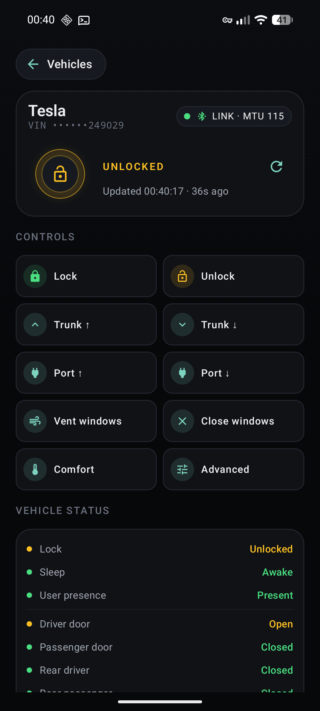
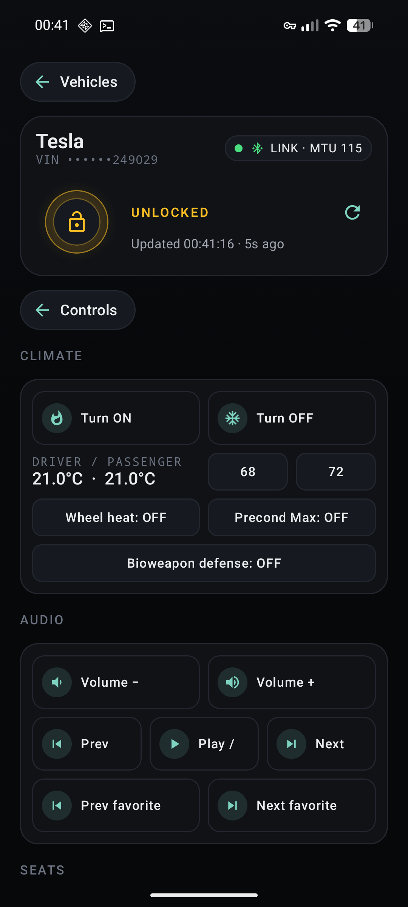
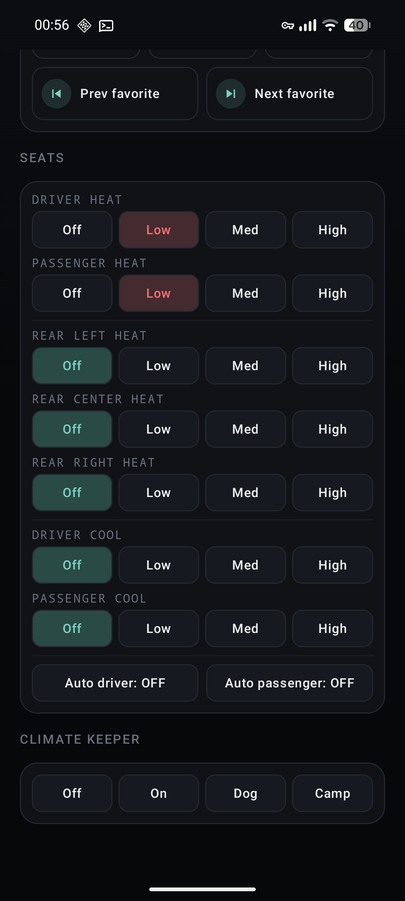
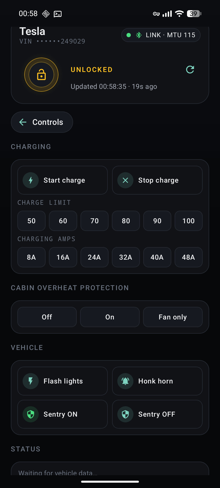
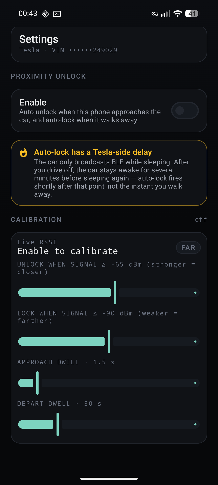
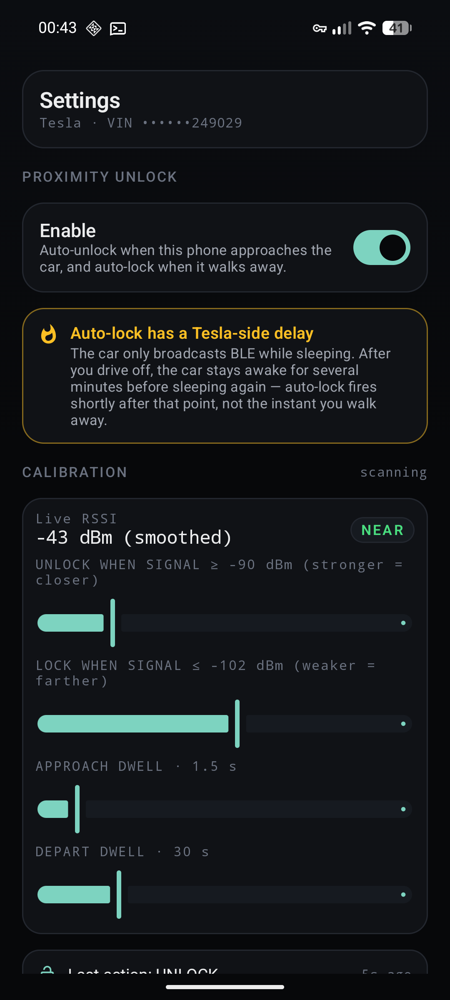

<p align="center">
  
</p>

<h1 align="center">TKey</h1>

A phone-only Tesla key for Android. No cloud. No internet. No Google Play Services.
The only runtime permission the app asks for is **Nearby devices** — that's it.
The pairing keypair is generated and stored inside your phone's secure element, and the
private half never leaves it.

This is a hobby project — a best-effort, low-battery alternative to the official Tesla
app for the small set of things a phone-as-a-key actually needs to do.

> [!IMPORTANT]
> Not affiliated with, endorsed by, or sponsored by Tesla, Inc. "Tesla" and "Model 3 / Y /
> S / X / Cybertruck" are trademarks of Tesla, Inc. This is independent software that talks
> the public Tesla BLE key protocol over Bluetooth Low Energy. It is not a replacement for
> the official Tesla app, and is not intended to be relied on as your sole means of
> entering or operating your car.

<p align="center">
  
</p>

<p align="center">
  
  
  
</p>

<p align="center">
  
  
</p>

---

## What it does

Once paired with the car, TKey can:

- **Lock** and **unlock** the doors
- **Auto-unlock on approach and auto-lock on departure** when you opt into per-car
  Proximity unlock *(beta)* — see [Proximity unlock](#proximity-unlock-beta-opt-in) below
- Open and close the **trunk** and the **charge port**; **vent** and **close** the windows
- **Climate**: turn climate on/off, set driver / passenger target temperatures (one-tap
  **68 °F / 72 °F** presets, in addition to whatever the car already has set), toggle
  bioweapon-defense mode, steering-wheel heat, preconditioning max
- **Audio / media**: play / pause, next / previous track, next / previous favorite,
  volume up / down
- **Seats**: heat and cooler levels for all seats; auto-seat climate
- **Climate keeper**: Off / On / Dog / Camp modes, with **cabin overheat protection**
  (Off / On / Fan only)
- **Charging**: start / stop, charge-limit presets (50–100 %), charging-current limit
- **Sentry mode** on/off, **flash lights**, **honk horn**
- Refresh and display **vehicle status** (lock state, sleep state, user presence,
  individual closures including **frunk** and **tonneau** (Cybertruck),
  **remaining range / battery %**, etc.)
- **Auto-reconnect** with backoff whenever the BLE link drops

It runs the BLE leg of the Tesla key protocol end-to-end:

1. mDNS-free BLE discovery: matches the Tesla-broadcast `T<8-byte-VIN-hash>` short-name
   beacon for your VIN
2. GATT connect, MTU negotiation, notification enablement on the vehicle's RX/TX
   characteristics
3. ECDH (P-256) with the vehicle's static public key inside Android Keystore
4. AES-128-GCM session, derived per the Tesla reference implementation
   (`K = SHA1(X_shared)[:16]`)
5. VCSEC command/response framing with replay-protection counters

## What it isn't

- **Not a replacement for the official Tesla app.** It can't watch sentry video or talk
  to the car when you're not standing next to it. Anything that needs Tesla's cloud is
  out of scope by design.
- **Not a long-range key.** BLE range is roughly walking-up-to-the-car distance. The car
  also only advertises while asleep — once you're inside or the car is awake from another
  source, it stops broadcasting until it sleeps again.
- **Not a UWB phone-as-key.** Proximity unlock here uses BLE RSSI, which is good enough
  for "walk up to the car and the doors unlock" but lacks the centimeter-accurate
  positioning of the iPhone / Android UWB experience.
- **Not Cybertruck-only or Model-something-only.** It speaks the modern VCSEC protocol that
  all current cars use, but quirks per model/firmware exist and we have what we have.

## Proximity unlock (beta, opt-in)

> [!NOTE]
> Proximity unlock is a **beta** feature. The hysteresis, dwell, and auto-pause logic
> have all been exercised on the author's own car, but Bluetooth signal behavior varies
> wildly between phones, cases, pockets, and garages. Treat the thresholds as something
> to calibrate per car using the live RSSI readout below, and keep your physical key /
> phone-app fallback handy.

In a saved car's **Settings**, flip on **Proximity unlock** to get walk-up entry. TKey
runs a small foreground service that watches the car's BLE beacon, smooths the RSSI with
an exponential moving average, and dispatches a real RKE unlock when the signal crosses
your **Unlock RSSI** threshold — and a lock when it drops below your **Lock RSSI**
threshold.

Both thresholds are sliders in the Settings screen, paired with a **live RSSI readout**
that updates in real time as you move toward and away from the car so you can calibrate
to your own keyrings, walls, and pockets. You also get sliders for the **approach** and
**depart dwell** times — how long the signal has to stay above (or below) the threshold
before TKey actually fires. Hysteresis between the two thresholds prevents flapping at
the edge of range, and a built-in 60 s cool-down keeps the FSM from oscillating after a
fire.

### Auto-pause

TKey doesn't burn battery scanning when nothing's happening. After **10 minutes** with
no beacon seen and no significant motion from the phone, the proximity service suspends
scanning entirely and arms Android's `TYPE_SIGNIFICANT_MOTION` trigger sensor. The next
time you actually move — walk to the car, get up off the couch — scanning resumes
instantly. While suspended the proximity service contributes essentially nothing to the
phone's power draw.

The service also stops itself outright the moment no saved car has Proximity unlock
enabled. Nothing runs when the feature is off.

### Caveats

- **Auto-lock fires only after the car re-sleeps.** Tesla cars only advertise BLE while
  sleeping; the moment you open a door the car wakes and goes radio-silent until its
  sleep timer expires (typically several minutes after last activity). Auto-lock needs a
  fresh weak beacon to fire — which means it triggers shortly after the car has gone
  back to sleep at its new location, not the instant you walk away. The Settings screen
  surfaces this caveat in-app.
- **Range is BLE range.** Roughly the inside of your driveway / garage. Don't expect
  walk-up unlock from across the street.
- **Proximity is per-car.** Enable it on the cars you actually use; the others stay in
  manual-control mode and contribute nothing to scanning load.

## Privacy & security model

The headline guarantees are easy to verify from this repo and from the manifest:

### No internet, no cloud

The default runtime ask is **Nearby devices** — the single Android 12+ permission prompt
that covers Bluetooth scanning and Bluetooth connecting. If you turn on Proximity unlock,
TKey additionally requests the **Notifications** permission so the foreground-service
notification can be shown. That is the entire runtime surface.

The full manifest ([`AndroidManifest.xml`](app/src/main/AndroidManifest.xml)) is:

```xml
<uses-permission android:name="android.permission.BLUETOOTH_SCAN"
                 android:usesPermissionFlags="neverForLocation" />
<uses-permission android:name="android.permission.BLUETOOTH_CONNECT" />
<uses-permission android:name="android.permission.FOREGROUND_SERVICE" />
<uses-permission android:name="android.permission.FOREGROUND_SERVICE_CONNECTED_DEVICE" />
<uses-permission android:name="android.permission.POST_NOTIFICATIONS" />
```

The two Bluetooth entries are grouped under the user-facing "Nearby devices" toggle in
Android Settings. The three foreground-service entries are only exercised when Proximity
unlock is enabled for at least one car — the service stops itself the moment no car has
the feature on. Notably absent: **no** `INTERNET`, **no** location of any kind, **no**
phone state, **no** contacts, **no** storage, **no** wake lock, **no** boot-completed.

Because there is no `INTERNET` permission, the app cannot open a socket, fetch a URL,
ping a server, or post telemetry. This is enforced by Android itself, not by app code —
if the manifest doesn't declare `INTERNET`, the syscall is blocked at the kernel level.

There is **no Google Play Services**, no Firebase, no analytics SDK, no crash reporter.
The dependency tree (see [`gradle/libs.versions.toml`](gradle/libs.versions.toml)) is:

- Jetpack Compose UI + Material 3
- AndroidX lifecycle + activity
- `kotlinx.coroutines`
- Google's `protobuf-kotlin-lite` (for the public Tesla `.proto` schemas)
- Google's `tink-android` (cryptographic primitives only — no network)

That's the entire third-party surface.

### Private key in the secure element

The pairing keypair is a NIST P-256 ECDH/ECDSA key, generated on first launch via
[`KeyPairGenerator` with the `AndroidKeyStore` provider](core/crypto/src/main/kotlin/com/tkey/crypto/Identity.kt).
It is generated *inside* the device's secure element and is never exported.

On devices with a **StrongBox** secure element (Pixel 3+ and most modern flagships) the
key lives on a dedicated tamper-resistant chip. On devices without StrongBox but with a
Trusted Execution Environment (the vast majority of phones since ~2017), the key lives
inside the TEE. On older devices that have neither, the key is software-backed but still
sandboxed by the OS.

The app displays which security level you have inside its **Diagnostics** panel.

When the app derives a session with the car, the ECDH operation runs *inside* the
keystore via `KeyAgreement` — the app sees only the resulting AES-GCM session key, never
the private scalar. Unenroll the phone from the car and the keypair becomes useless;
delete the app and the keypair is destroyed with it.

### Saved car data

The only state the app persists on disk is in
[`SharedPreferences`](app/src/main/kotlin/com/tkey/ui/CarStore.kt):

- Display name and VIN of saved cars (up to 10)
- The VIN of the most recently used car, for auto-resume on next launch

That's it. No usage logs, no command history, no error reporting.

### What the car sees

The car learns:

- Your phone's public P-256 key (this is the entire point of pairing — it's how the car
  recognizes you next time)
- A name you choose during enrollment ("TKey phone")

That's the entirety of the data the car retains about TKey. Stock Tesla telemetry will
still see BLE commands hitting VCSEC the same way it sees commands from the official app
or a Model 3 keycard.

## Battery

TKey is meant to be cheap to leave running:

- **No background work unless you opt in.** With Proximity unlock off (the default),
  the app only scans and connects when it's open and the screen is on. With Proximity
  unlock on for at least one car, a foreground service runs — but auto-pauses after
  10 minutes of no beacons + no motion (see
  [Proximity unlock § Auto-pause](#auto-pause)).
- **BLE only.** No periodic Wi-Fi connection, no cellular request, no Play Services
  heartbeat. Once connected, it sends 1 PING-ish frame per heartbeat interval and
  otherwise idles.
- **Auto-reconnect uses exponential backoff** (1s → 2s → 5s → 15s → 30s) so a car that's
  driven away doesn't cause the radio to hammer.
- **No location.** The `BLUETOOTH_SCAN` permission is declared with
  `usesPermissionFlags="neverForLocation"`, so Android does not surface a "TKey is using
  your location" indicator and does not gate the scan on location services.

The realistic battery impact on a modern Pixel/Galaxy with the app open and a car nearby
is in the same range as having Bluetooth audio paired but idle — a small fraction of a
percent per hour. With Proximity unlock on, the same number holds while the service is
actively scanning, and drops near zero while it's paused waiting for motion.

## Pairing flow

Before TKey can do anything, the car has to remember its public key.

1. Make sure your car is **asleep** (this is when it advertises BLE — typically after
   ~10 minutes parked and untouched).
2. In TKey, **Add vehicle**, give it a friendly name, paste your 17-character VIN.
3. Tap the car tile. TKey scans, finds the beacon, connects, and starts a session.
4. When the hero card shows the amber **TAP KEYCARD NOW** banner, place your physical
   Tesla keycard on the center console reader (between the front cup holders).
5. The car beeps; the banner clears; TKey now has an enrolled key on the car.

You only do this once per car. On future launches, TKey remembers your last car and
auto-resumes the connection — open the app, walk up to the car, hit Unlock.

If you remove the app or replace your phone, the keypair is gone and you'll need to
re-enroll with the keycard.

## Building from source

Pinned to Android Studio Panda Patch 4 / AGP 9.2.1 / Kotlin 2.2.20. The Gradle wrapper
scripts are not yet checked in; until they are, build with the Gradle binary that Studio
downloads on first sync, and the JBR that ships with Studio:

```bash
JAVA_HOME=$HOME/Downloads/android-studio-panda4-patch1-linux/android-studio/jbr \
  $HOME/.gradle/wrapper/dists/gradle-9.5.1-bin/*/gradle-9.5.1/bin/gradle \
  :app:assembleDebug --console=plain
```

Install on a device with Bluetooth LE (`api 31+`):

```bash
adb install -r app/build/outputs/apk/debug/app-debug.apk
adb shell pm grant com.tkey.debug android.permission.BLUETOOTH_SCAN
adb shell pm grant com.tkey.debug android.permission.BLUETOOTH_CONNECT
```

(The `pm grant` lines are optional — the app will prompt for these permissions on first
use.)

## Project layout

```
tkey/
├── app/                      Android app shell (Compose UI)
│   └── src/main/kotlin/com/tkey/ui/
│       ├── MainActivity.kt   Compose screens, theme, components
│       ├── CarController.kt  scan → connect → handshake → ready FSM
│       ├── CarStore.kt       saved-car SharedPreferences storage
│       ├── proximity/        Proximity unlock
│       │   ├── ProximityConfig.kt    per-car settings (RSSI thresholds, dwell)
│       │   ├── ProximityFsm.kt       EMA + hysteresis + dwell state machine
│       │   ├── ProximityRegistry.kt  process-wide bridge between UI and service
│       │   └── ProximityService.kt   foreground service (single scan loop,
│       │                             per-VIN FSMs, motion-aware auto-pause)
│       └── theme/            Color, Theme, Typography
├── core/
│   ├── ble/                  BLE discovery + GATT transport
│   │   ├── CarScanner.kt
│   │   ├── CarConnection.kt
│   │   ├── VinHash.kt
│   │   └── Beacon.kt
│   ├── crypto/               P-256 identity, AES-GCM session, metadata signing
│   │   ├── Identity.kt
│   │   ├── Session.kt
│   │   └── Metadata.kt
│   ├── proto/                generated Tesla protobufs (vcsec, signatures, …)
│   └── session/              TeslaSession — encrypted protocol layer
│       └── TeslaSession.kt
├── proto/                    upstream .proto sources (vendored)
└── LICENSE                   Apache 2.0
```

## Permissions reference

TKey requests at most **two** runtime permissions: one is always needed, the other is
only requested if you opt into Proximity unlock.

| Android user-facing prompt | Manifest entries | Why | When asked |
|---|---|---|---|
| **Nearby devices** | `BLUETOOTH_SCAN` (with `neverForLocation`), `BLUETOOTH_CONNECT` | Discover the car's BLE beacon and open a GATT link to it | First time you tap a saved car |
| **Notifications** | `POST_NOTIFICATIONS`, `FOREGROUND_SERVICE`, `FOREGROUND_SERVICE_CONNECTED_DEVICE` | Show the persistent "TKey proximity" notification while the proximity service is running | First time you turn Proximity unlock on for a car (Android 13+) |

The three foreground-service permissions in row 2 are install-time on the manifest, but
the service itself only runs when at least one car has Proximity unlock turned on. With
the feature off, no service runs and no notification appears.

Concretely, TKey does **not** ask for and the manifest does **not** declare any of:

`INTERNET` · `ACCESS_FINE_LOCATION` · `ACCESS_COARSE_LOCATION` ·
`ACCESS_BACKGROUND_LOCATION` · `READ_PHONE_STATE` · `WAKE_LOCK` ·
`RECEIVE_BOOT_COMPLETED` · `CAMERA` · `READ_CONTACTS` ·
`READ_EXTERNAL_STORAGE` · `WRITE_EXTERNAL_STORAGE`.

You can verify all of the above yourself by inspecting the installed APK with
`adb shell dumpsys package com.tkey.debug | grep permission` or by reading
[`AndroidManifest.xml`](app/src/main/AndroidManifest.xml).

## Compatibility notes

- Tested against current Model 3 / Y / S / X / Cybertruck firmware.
- The car only advertises BLE while sleeping. If the app says **SCANNING** for more than
  a few seconds, briefly tap a door handle to wake the car so it broadcasts again — or
  wait for the car to fall asleep on its own.
- Some phones' BLE scanners silently drop short-name-only Tesla advertisements through
  `BluetoothLeScanner.startScan`. TKey works around this on affected devices by falling
  back to `BluetoothAdapter.startDiscovery`.
- StrongBox-backed keys may be slightly slower on the first ECDH of a session (one-time
  hardware initialization cost). This is invisible above the BLE round-trip jitter.

## Status

Best-effort. Things that work today:

- Discovery, connection, session handshake, vehicle status, lock/unlock,
  frunk/trunk/tonneau/charge-port, vent/close windows, auto-reconnect
- Full HVAC: climate on/off, driver/passenger target temps, bioweapon, steering-wheel
  heat, max defrost, climate keeper (off / on / dog / camp), cabin overheat protection
- Seats: heat and cooler levels for all seats; auto-seat climate
- Charging: start / stop, charge-limit and charging-amps presets
- Media: play / pause, next / previous track, next / previous favorite, volume bump
  and absolute set
- Sentry mode toggle, flash lights, honk horn
- **Proximity unlock**: per-car RSSI-based auto-unlock and auto-lock with hysteresis,
  dwell timers, live RSSI calibration, and motion-aware foreground-service auto-pause
- Keycard enrollment of new phones
- Hardware-backed P-256 identity, AES-GCM session crypto

Things that don't (yet):

- Drive authorization (the "PIN to drive" path)
- A Gradle wrapper (`gradlew`) — currently you need the gradle binary Studio downloads

If something doesn't work for your car, open an issue with the **Diagnostics** panel
contents (it's intentionally PII-free — there's no VIN, no GPS, no account ID, just
phase/transport/session counters).

## License

[Apache License 2.0](LICENSE).

## Acknowledgements

TKey speaks the protocol described and implemented by:

- [`teslamotors/vehicle-command`](https://github.com/teslamotors/vehicle-command) —
  Tesla's own open-source reference; the canonical source for the AES-GCM / HMAC scheme
  and the VCSEC / Infotainment message shapes.
- The wider community that reverse-engineered the BLE characteristic IDs, advertising
  format, and counter semantics long before the protocol was officially documented.

The `.proto` schemas under [`proto/`](proto/) are vendored from upstream and bear their
original copyrights.
